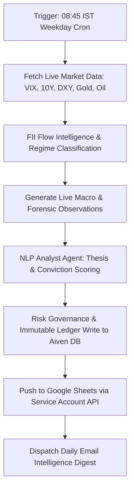

<div align="center">

# Sovereign Alpha: NLP Data-as-a-Service for Quantitative Finance

**Next-Generation Algorithmic Trading and Indian Equities NLP**

*Identify variant perception. Quantify hidden risk. Capture non-consensus alpha.*

[](https://python.org)
[](https://github.com/features/actions)
[](https://docs.google.com/spreadsheets)
[](https://aiven.io)

</div>

## Overview

Sovereign Alpha is a headless **Data-as-a-Service (DaaS)** intelligence engine designed exclusively for **Quantitative Finance** and **Algorithmic Trading**. Operating as a pure backend data feed without web servers or frontend overhead, Sovereign Alpha continuously extracts divergence metrics, high-conviction signals, and thesis tracking across **Indian Equities**.

### Core Delivery Channels

1. **Automated Google Sheets Push**: Direct, real-time push to client Google Spreadsheets via the Google Sheets API (`gspread` & Service Account authentication).
2. **Daily Intelligence Email Digest**: Automated institutional scorecard dispatched directly to subscribers each morning detailing market regime, FII flows, validated predictions, and forensic observations.

---

## Daily Pipeline Execution Flow

The daily pipeline is fully orchestrated via GitHub Actions (`daily-pipeline.yml`), triggering every weekday morning at **08:45 IST (03:15 UTC)**:



### Pipeline Steps:

1. **Market Data & Macro Regime**: Ingests real-time indicators (VIX, US 10Y Yields, DXY, Gold, Crude) and classifies the macro regime (`RISK_ON` / `RISK_OFF` / `NEUTRAL`).
2. **FII Flow & Observation Engine**: Tracks institutional liquidity flow and converts incoming forensic disclosures and market signals into structured database observations.
3. **Forensic Divergence & Conviction Scoring**: Cross-references concall transcripts against reported financial statements to detect accounting irregularities, narrative shifts, and margin compression.
4. **Risk Governance**: Evaluates proposals against drawdown thresholds before committing cleared predictions to the PostgreSQL ledger.
5. **Google Sheets API Push (`push_to_sheets.py`)**: Formats and streams today's macro regime, predictions, and observations directly into target client spreadsheets.
6. **Email Digest (`email_digest.py`)**: Assembles and dispatches the daily performance and market intelligence scorecard via SMTP.

---

## Google Sheets Integration

Subscribers receive structured data directly in their Google Sheet under the **Daily Intelligence** tab:

| Section | Contents |
|---|---|
| **Header & Run Metadata** | Run timestamp (IST) and system status |
| **Macro Regime** | Current regime classification, confidence score, and key market drivers |
| **Today's Predictions** | Asset, sector, confidence %, status (`cleared` / `risk-rejected`), thesis |
| **Today's Observations** | Real-time timestamps, ticker, severity (`HIGH` / `MEDIUM` / `LOW`), headline |

---

## Programmatic Access (Python / Pandas)

Quants and data scientists can connect directly to the Aiven PostgreSQL instance or ingest the live data for backtesting and model training:

```python
import os
import pandas as pd
import psycopg2
from psycopg2.extras import RealDictCursor

# Connect directly to the Sovereign Alpha database
conn = psycopg2.connect(
    os.environ["DATABASE_URL"],
    cursor_factory=RealDictCursor
)

# Fetch latest cleared predictions
query = """
    SELECT timestamp, asset, sector, confidence_score, status, thesis
    FROM prediction_ledger
    WHERE status = 'cleared'
    ORDER BY timestamp DESC
    LIMIT 50;
"""
df = pd.read_sql(query, conn)
print(df.head())
```

---

## System Architecture

| Component | Technology / Service |
|---|---|
| **Architecture Model** | Headless Data-as-a-Service (DaaS) |
| **Automation & Orchestration** | GitHub Actions (`.github/workflows/daily-pipeline.yml`) |
| **Database** | Aiven PostgreSQL 17 (Cloud Database) |
| **Data Distribution** | Google Sheets API (`gspread` / Google OAuth2 Service Account) |
| **Email Dispatch** | Python SMTP / SSL (`email_digest.py`) |
| **Market Data Ingestion** | `yfinance`, FRED API, NSE India FII Intelligence |
| **LLM & Inference** | Mistral AI / Cerebras Inference (`gpt-oss-120b`) |
| **Runtime Environment** | Python 3.11 |

---

## Environment Secrets Configuration

The headless pipeline requires the following GitHub Repository Secrets:

- `DATABASE_URL` / `AIVEN_DATABASE_URL`: Aiven PostgreSQL connection string.
- `GOOGLE_CREDENTIALS`: Service Account JSON credentials string.
- `GOOGLE_SHEET_ID`: Target Google Spreadsheet ID.
- `DIGEST_EMAIL` & `DIGEST_PASSWORD`: SMTP credentials for daily intelligence email dispatch.
- `CEREBRAS_API_KEY`: API key for high-throughput LLM forensic thesis generation.
